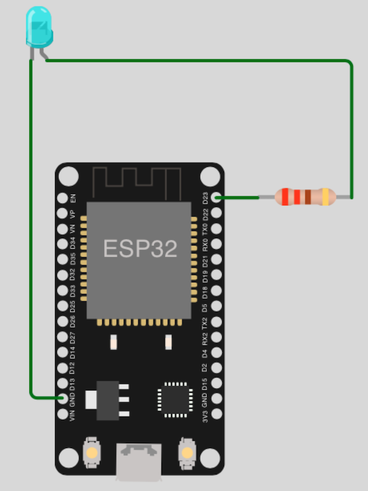
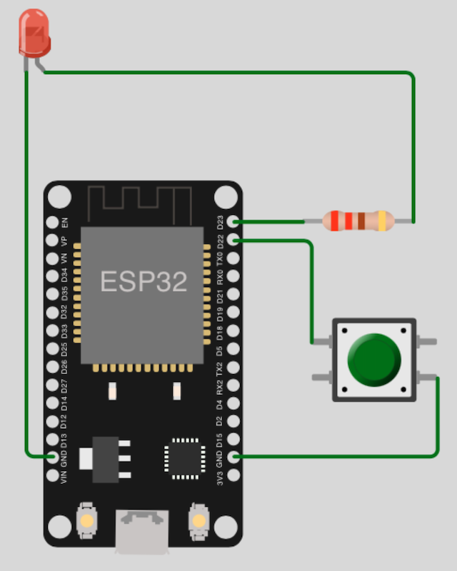
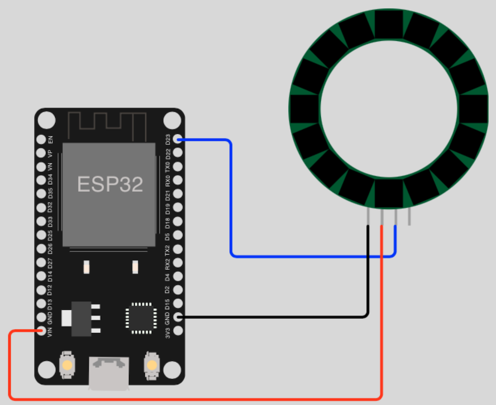

# LED Help

## One single LED

### Necessary parts

- 1x LED (_any color_)
- 1x Resistor (_min. 220 ohms_)

### Circuit diagram

## Turn single LED ON/OFF with button

### Necessary parts

- 1x Button
- 1x LED (_any color_)
- 1x Resistor (_min. 220 ohms_)

### Circuit diagram

## One RGB LED

### Necessary parts

- 1x RGB LED
- 3x Resistors (_min. 220 ohms_)

### Circuit diagram

## Touch 3 single LEDs ON/OFF

### Necessary parts

- 1x red RGB LED
- 1x green RGB LED
- 1x blue RGB LED
- 3x Resistors (_min. 220 ohms_)

## NeoPixel (_WS2812B addressable RGB LED's_)

### Necessary parts

- NeoPixel (strip/ring) or WS2812B addressable RGB LED's

### Circuit diagram

[Go Back](https://github.com/Lupin3000/ESP)
