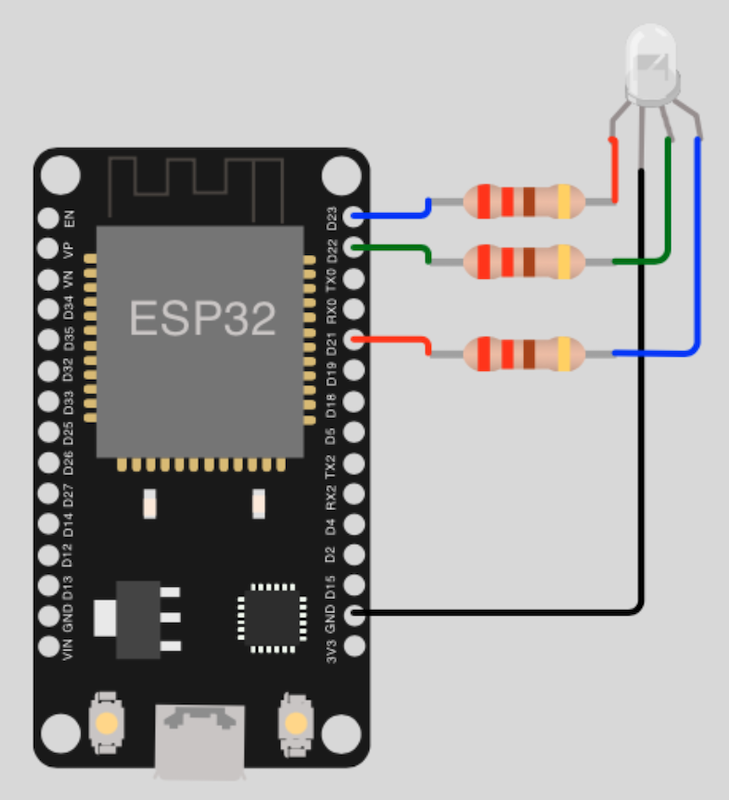

# LED Help

## One single LED

### Necessary parts

- 1x LED (_any color_)
- 1x Resistor (_min. 220 ohms_)

### Circuit diagram

## One RGB LED

### Necessary parts

- 1x RGB LED
- 3x Resistors (_min. 220 ohms_)

### Circuit diagram

