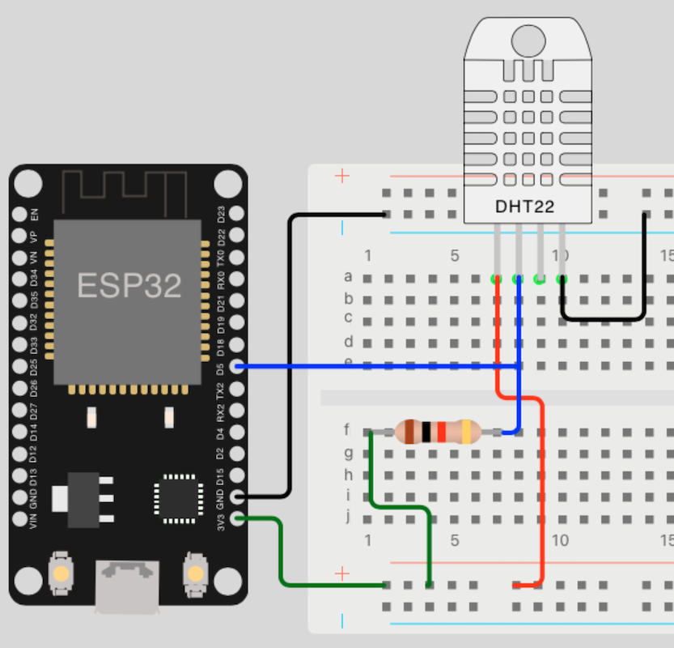

# Sensor Help

## IR Flame Sensor

### Necessary parts

- 1x LED (_any color_)
- 1x Resistor (_min. 220 ohms_)
- 1x Flame Sensor (_3 Pin Digital_)

## Light/Shadow detection

### Necessary parts

- 1x LED (_any color_)
- 1x Resistor (_min. 220 ohms_)
- 1x Photo resistor
- 1x Resistor (_min. 10 kilo ohms_) 

## Temperature/Humidity with DHT11

> You can use the same source code and circuit diagram for DHT11 and DHT22! Only the import  and object must adapted for specific device.

```python
# DHT11 import
from dht import DHT11

# DHT22 import
from dht import DHT22

# ...

# DHT11 object
sensor = DHT11(Pin(DHT_GPIO_PIN))

# DHT22 object
sensor = DHT22(Pin(DHT_GPIO_PIN))
```

Minimum values for `DELAY` and ranges:

| Device | Delay  | Temperature  | Humidity   |
|--------|--------|--------------|------------|
| DHT11  | 1 sec. | 0 to 50 °C   | 20 to 90%  |
| DHT22  | 2 sec. | -40 to 80 °C | 0 to 100%  |

### Necessary parts

- 1x DHT11 Sensor (_or DHT22 Sensor_)
- 1x Resistor (_min. 10 kilo ohms_)

### Circuit diagram



[Go Back](https://github.com/Lupin3000/ESP)
