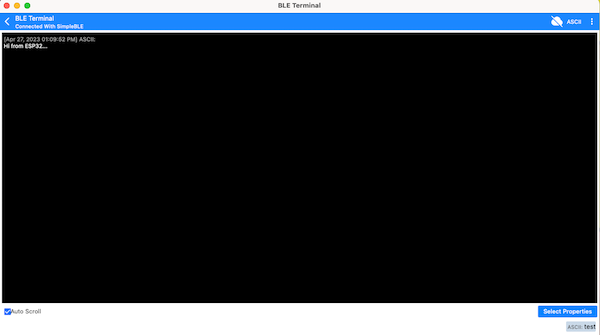

# Bluetooth Low Energy tutorials

## Table of Contents

- [Prolog](#prolog)
- [Scan for BLE devices](#scan-for-ble-devices)
- [Own BLE service](#own-ble-service)
- [Additional information](#additional-information)

## Prolog

IoT without Bluetooth is almost impossible these days. Current versions of MicroPython already support Bluetooth Low Energy (_although this is still being developed_). So that you can later for example can control NeoPixel via BLE, or transmit values from sensors via BLE, here some very first basic examples.

## Scan for BLE devices

The simplest action is to find nearby BLE devices and then list them inside REPL (_including some information_).

```shell
# create new subdirectory
$ mkdir -p ~/Projects/ESP32/examples/ble

# create script
$ touch ~/Projects/ESP32/examples/ble/ble_scanner.py
```

> [Source Code](../examples/ble/ble_scanner.py) for `ble_scanner.py`

Copy the script to the microcontroller as `main.py`.

```shell
# copy file into pyboard as main.py
(venv) $ rshell -p [SERIAL-PORT] cp Tutorials/ble/ble_scanner.py /pyboard/main.py

# start repl
(venv) $ rshell -p [SERIAL-PORT] repl
```

Now press `Control` + `d` for a Soft Reboot of the device. After few seconds, you should see the final scan report inside the REPL. To stop the application plus to close REPL and rshell connection, press first `Control` + `c` and second `Control`+ `x`.

## Own BLE service

The next example shows (_just for understanding_) how to let 2 devices communicate via BLE. Communication uses READ and NOTIFY (_which is limited to certain ASCII character lengths_).

> This example does not use specified UUIDs (_it will use random generated UUIDs_)! To follow the example, a `BLE Serial Terminal` is required on a device (_with Bluetooth Low Energy_).

Here few examples for possible applications, you can try:

- [Android / IOS](https://punchthrough.com/lightblue/)
- [Android](https://play.google.com/store/apps/details?id=com.mightyit.gops.bleterminal&hl=de&gl=US&pli=1)
- [macOS / iPhone / iPad](https://apps.apple.com/de/app/ble-terminal-hm-10/id1398703795)
- [Windows](https://apps.microsoft.com/store/detail/bluetooth-serial-terminal/9WZDNCRDFST8?hl=de-de&gl=de&activetab=pivot%3Aoverviewtab)

```shell
# create script
$ touch ~/Projects/ESP32/examples/ble/ble_service.py
```

> [Source Code](../examples/ble/ble_service.py) for `ble_service.py`

```shell
# copy file into pyboard as main.py
(venv) $ rshell -p [SERIAL-PORT] cp Tutorials/ble/ble_service.py /pyboard/main.py

# start repl
(venv) $ rshell -p [SERIAL-PORT] repl
```

Press the keys `Control` + `d` or the `reset button` and observe the output. As soon as your ESP starts to advertise the BLE service, you can use the `BLE Serial Terminal` on a second device to communicate.

Here the example output from ESP:

```
[INFO] Start ble services and irq for SimpleBLE
[INFO] Start ble advertise as SimpleBLE...
[INFO] A central has connected to this peripheral
[INFO] A peripheral send notification: Hi from ESP32... to central
[INFO] A central has written this: test
[INFO] A central has disconnected from this peripheral
```

Here the example output from other device:



To stop the program, press keys `Control` + `c`. If you want to leave the REPL, press keys `Control` + `x`.

## Additional information

Later examples then fall back on this basic examples. For example, the usage of sensors will be described.

[Home](https://github.com/Lupin3000/ESP) | [Previous](./007_wlan_tutorials.md) | [Next]()
