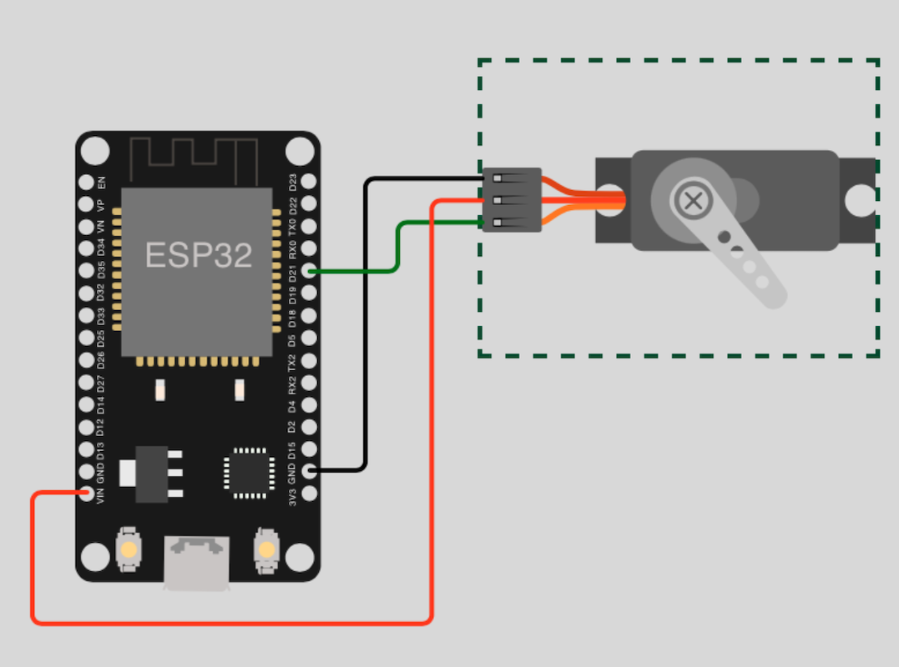

# Motor

## Table of Contents

- [Prolog](#prolog)
- [Control servo via duty](#control-servo-via-duty)
- [Control servo via duty_ns](#control-servo-via-dutyns)
- [Control servo via duty_u16](#control-servo-via-dutyu16)

## Prolog

Now bring some movement into the game. Again, PWM` is used here. When experimenting with servos, be careful not to overdrive them! I had to get new ones after they broke very quickly.

## Control servo via duty

The first option to steer the servo motor in a range of 90° is `duty`.

### Requirements

- mandatory 1x servo motor (_example: SG90_)
- few cables 
- optional a breadboard

### Circuit



### Code

```shell
# create new subdirectory
$ mkdir -p ~/Projects/ESP/examples/motor

# create script
$ touch ~/Projects/ESP/examples/motor/servo_duty.py
```

> [Source Code](../examples/motor/servo_duty.py) for `servo_duty.py`

Check your circuit and copy the script to the microcontroller as `main.py`.

```shell
# copy file into pyboard as main.py
(venv) $ rshell -p [SERIAL-PORT] cp examples/motor/servo_duty.py /pyboard/main.py

# start repl
(venv) $ rshell -p [SERIAL-PORT] repl
```

Start with keys `Control` + `d`. To leave the REPL, press keys `Control` + `x`.

## Control servo via duty_ns

The second option to steer the servo motor in a range of 90° is `duty_ns`. The circuit stays the same only the code is slightly adjusted.

### Requirements

... same as [previous example](#requirements) ...

### Circuit

... same as [previous example](#circuit) ...

### Code

```shell
# create script
$ touch ~/Projects/ESP/examples/motor/servo_duty_ns.py
```

> [Source Code](../examples/motor/servo_duty_ns.py) for `servo_duty_ns.py`

Check your circuit and copy the script to the microcontroller as `main.py`.

```shell
# copy file into pyboard as main.py
(venv) $ rshell -p [SERIAL-PORT] cp examples/motor/servo_duty_ns.py /pyboard/main.py

# start repl
(venv) $ rshell -p [SERIAL-PORT] repl
```

Start with keys `Control` + `d`. To leave the REPL, press keys `Control` + `x`.

## Control servo via duty_u16

The second option to steer the servo motor in a range of 90° is `duty_u16`. The circuit stays the same only the code is slightly adjusted.

### Requirements

... same as [previous example](#requirements) ...

### Circuit

... same as [previous example](#circuit) ...

### Code

```shell
# create script
$ touch ~/Projects/ESP/examples/motor/servo_duty_u16.py
```

> [Source Code](../examples/motor/servo_duty_u16.py) for `servo_duty_u16.py`

```shell
# copy file into pyboard as main.py
(venv) $ rshell -p [SERIAL-PORT] cp examples/motor/servo_duty_u16.py /pyboard/main.py

# start repl
(venv) $ rshell -p [SERIAL-PORT] repl
```

Start with keys `Control` + `d`. To leave the REPL, press keys `Control` + `x`.

[Home](https://github.com/Lupin3000/ESP) | [Previous](./007_sound_tutorials.md) | [Next](./009_neopixel_tutorials.md)
