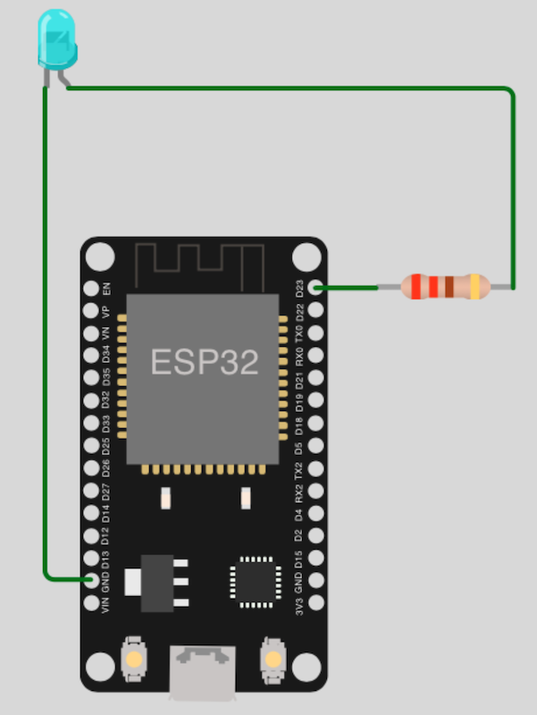
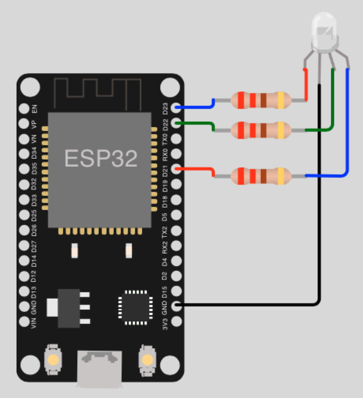

# GPIO basic tutorials

## Table of Contents

- [Prolog](#prolog)
- [Blink a single LED (High/Low)](#blink-a-single-led-highlow)
- [Blink a single LED (High/Low) with Timer](#improved-version-with-timer)
- [Fade a single LED (High/Low) with PWM](#fade-a-single-led-highlow-with-pwm)
- [Change RGB LED color (High/Low)](#change-rgb-led-color-highlow)

## Prolog

If you consider yourself a beginner, you should learn the basics first. So now, as with many other instructions, here are a few very simple circuits and code examples. In order to follow the instructions you will need additional components from now on (_these are listed for each tutorial_).

> Depending on your ESP device, you also have to change the pins in the respective code! Check the pinout diagram for your device and simply adjust the constant inside the code (_directly after the imports_).

## Blink a single LED (High/Low)

In the first example, a simple LED is switched on/off endlessly.

### Requirements

- mandatory 1x LED (_any color_)
- mandatory 1x Resistor (_min. 220 ohms_)
- few cables
- optional few breadboard

### Circuit



### Code

```shell
# create new subdirectory
$ mkdir -p ~/Projects/ESP32/examples/gpio_basic

# create script
$ touch ~/Projects/ESP32/examples/gpio_basic/blink_single_led_high_low.py
```

> [Source Code](../examples/gpio_basic/blink_single_led_high_low.py) for `blink_single_led_high_low.py`

Check your circuit and copy the script to the microcontroller as `main.py`.

```shell
# copy file into pyboard as main.py
(venv) $ rshell -p [SERIAL-PORT] cp examples/gpio_basic/blink_single_led_high_low.py /pyboard/main.py

# start repl
(venv) $ rshell -p [SERIAL-PORT] repl
```

To stop the program, press keys `Control` + `c`. If you want to leave the REPL, press keys `Control` + `x`.

### Improved version (_with Timer_)

You can also realize the blinking in a different way! Therefore, MicroPython and ESP offers the feature of `Timers`. Circuit and requirements stay the same. Only the code needs to be adapted.

```shell
# create script
$ touch ~/Projects/ESP32/examples/gpio_basic/blink_single_led_high_low_timer.py
```

> [Source Code](../examples/gpio_basic/blink_single_led_high_low_timer.py) for `blink_single_led_high_low_timer.py`

Check your circuit and copy the script to the microcontroller as `main.py`.

```shell
# copy file into pyboard as main.py
(venv) $ rshell -p [SERIAL-PORT] cp examples/gpio_basic/blink_single_led_high_low_timer.py /pyboard/main.py

# start repl
(venv) $ rshell -p [SERIAL-PORT] repl
```

To stop the program, press keys `Control` + `c`. If you want to leave the REPL, press keys `Control` + `x`.

## Fade a single LED (High/Low) with PWM

In the previous example, the transition from `high` to `low` was very "hard". But you can use `PWM` (_Pulse-width modulation_) to do this some "smoother". The circuit is not changed for this, only the code.

### Requirements

... same as [previous example](#requirements) ...

### Circuit

... same as [previous example](#circuit) ...

### Code

```shell
# create script
$ touch ~/Projects/ESP32/examples/gpio_basic/fade_single_led_high_low.py
```

> [Source Code](../examples/gpio_basic/fade_single_led_high_low.py) for `fade_single_led_high_low.py`

Check your circuit and copy the script to the microcontroller as `main.py`.

```shell
# copy file into pyboard as main.py
(venv) $ rshell -p [SERIAL-PORT] cp examples/gpio_basic/fade_single_led_high_low.py /pyboard/main.py

# start repl
(venv) $ rshell -p [SERIAL-PORT] repl
```

To stop the program, press keys `Control` + `c`. If you want to leave the REPL, press keys `Control` + `x`.

## Change RGB LED color (High/Low)

In the second example, an RGB LED is used. Here the color is changed endlessly (_without fading transition_).

### Requirements

- mandatory 1x RGB LED (_any color_)
- mandatory 3x Resistors (_min. 220 ohms_)
- few cables
- optional few breadboard

### Circuit



### Code

```shell
# create script
$ touch ~/Projects/ESP32/examples/gpio_basic/change_rgb_led_color_high_low.py
```

> [Source Code](../examples/gpio_basic/change_rgb_led_color_high_low.py) for `change_rgb_led_color_high_low.py`

Check your circuit and copy the script to the microcontroller as `main.py`.

```shell
# copy file into pyboard as main.py
(venv) $ rshell -p [SERIAL-PORT] cp examples/gpio_basic/change_rgb_led_color_high_low.py /pyboard/main.py

# start repl
(venv) $ rshell -p [SERIAL-PORT] repl
```

To stop the program, press keys `Control` + `c`. If you want to leave the REPL, press keys `Control` + `x`.

[Home](https://github.com/Lupin3000/ESP) | [Previous](./008_bluetooth_tutorials.md) | [Next]()
