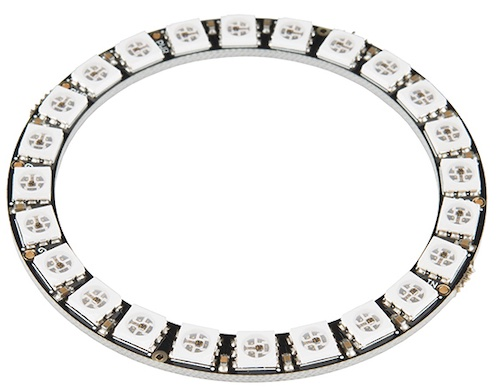
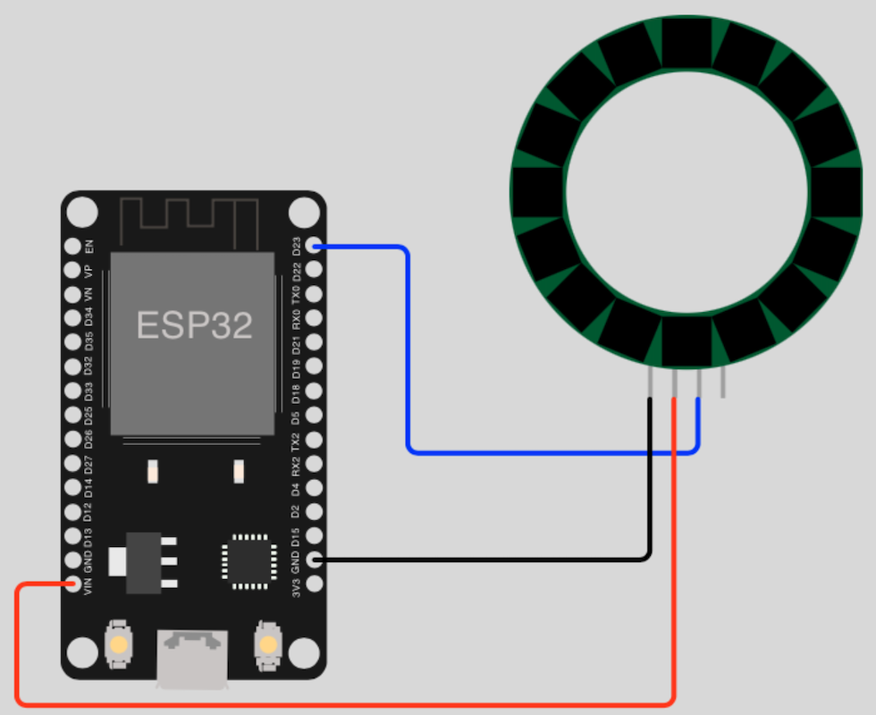

# NeoPixel

## Table of Contents

- [Prolog](#prolog)
- [NeoPixel basics](#neopixel-basics)
- [NeoPixel morse code](#neopixel-morse-code)

## Prolog

I personally love controlling NeoPixel with the ESP and MicroPython. In principle, you can quickly and easily implement your `DIY projects with it. Approx. 16 million colors are possible and the possibilities are almost endless, and they look fantastic.

> It doesn't matter whether you use a NeoPixel Ring, Strip or Matrix! The code should always work with the adjustment of the number.

> **Important:** From a certain number of NeoPixels, you need an additional power supply.

## NeoPixel basics

This example contains various functions to create effects with NeoPixel.

### Requirements

- mandatory 1x NeoPixel (_ring, strip or matrix_)
- few cables 
- optional a breadboard

**Example**



### Circuit



### Code

```shell
# create new subdirectory
$ mkdir -p ~/Projects/ESP/examples/neopixel

# create script
$ touch ~/Projects/ESP/examples/neopixel/neopixel_basics.py
```

> [Source Code](../examples/neopixel/neopixel_basics.py) for `neopixel_basics.py`

Check your circuit and copy the script to the microcontroller as `main.py`.

```shell
# copy file into pyboard as main.py
(venv) $ rshell -p [SERIAL-PORT] cp examples/neopixel/neopixel_basics.py /pyboard/main.py

# start repl
(venv) $ rshell -p [SERIAL-PORT] repl
```

Start with keys `Control` + `d`. Stop the loop with keys `Control` + `c`. To leave the REPL, press keys `Control` + `x`.

## NeoPixel morse code

In this example, a string is converted into Morse code and displayed visually.

### Requirements

... same as [previous example](#requirements) ...

### Circuit

... same as [previous example](#circuit) ...

### Code

```shell
# create script
$ touch ~/Projects/ESP/examples/neopixel/neopixel_morse.py
```

> [Source Code](../examples/neopixel/neopixel_morse.py) for `neopixel_morse.py`

Check your circuit and copy the script to the microcontroller as `main.py`.

```shell
# copy file into pyboard as main.py
(venv) $ rshell -p [SERIAL-PORT] cp examples/neopixel/neopixel_morse.py /pyboard/main.py

# start repl
(venv) $ rshell -p [SERIAL-PORT] repl
```

Start with keys `Control` + `d`. To leave the REPL, press keys `Control` + `x`.

[Home](https://github.com/Lupin3000/ESP) | [Previous](./008_motor_tutorials.md) | [Next](./009_neopixel_extended.md)
