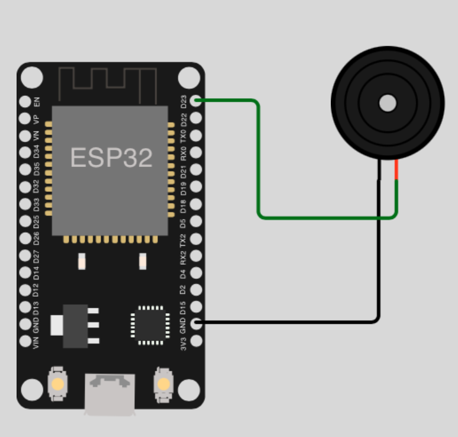

# Sound tutorials

## Table of Contents

- [Prolog](#prolog)
- [Create single tone (passive buzzer)](#create-single-tone-passive-buzzer)
- [Create different tones (passive buzzer)](#create-different-tones-passive-buzzer)
- [Play a song (passive buzzer)](#play-a-song-passive-buzzer)

## Prolog

Since you have made the first experiences with the GPIO pins (_incl. PWM_), let's use the knowledge and create acoustic signals (_as well as a song_).

> Please note that the pin assignment of your ESP microcontroller can be different! Adapt the circuit and the value of the corresponding constants.

## Create single tone (passive buzzer)

In fact, in this example, you're just creating a noisy tone with a passive buzzer. Be a little careful and try to be considerate of the people and animals nearby.

### Requirements

- mandatory 1x passive buzzer (_Piezo Buzzer_)
- few cables 
- optional a breadboard

### Circuit



### Code

```shell
# create new subdirectory
$ mkdir -p ~/Projects/ESP32/examples/sound

# create script
$ touch ~/Projects/ESP32/examples/sound/passive_buzzer_simple.py
```

> [Source Code](../examples/sound/passive_buzzer_simple.py) for `passive_buzzer_simple.py`

Check your circuit and copy the script to the microcontroller as `main.py`.

```shell
# copy file into pyboard as main.py
(venv) $ rshell -p [SERIAL-PORT] cp examples/sound/passive_buzzer_simple.py /pyboard/main.py

# start repl
(venv) $ rshell -p [SERIAL-PORT] repl
```

To leave the REPL, press keys `Control` + `x`.

## Create different tones (passive buzzer)

You can use `PWM` to create different tones! Just use different frequencies.

### Requirements

... same as [previous example](#requirements) ...

### Circuit

... same as [previous example](#circuit) ...

### Code

```shell
# create script
$ touch ~/Projects/ESP32/examples/sound/passive_buzzer_tones.py
```

> [Source Code](../examples/sound/passive_buzzer_tones.py) for `passive_buzzer_tones.py`

Check your circuit and copy the script to the microcontroller as `main.py`.

```shell
# copy file into pyboard as main.py
(venv) $ rshell -p [SERIAL-PORT] cp examples/sound/passive_buzzer_tones.py /pyboard/main.py

# start repl
(venv) $ rshell -p [SERIAL-PORT] repl
```

To leave the REPL, press keys `Control` + `x`.

## Play a song (passive buzzer)

The last example is actually a logical conclusion. Do you know Mario?

### Requirements

... same as [previous example](#requirements) ...

### Circuit

... same as [previous example](#circuit) ...

### Code

```shell
# create script
$ touch ~/Projects/ESP32/examples/sound/passive_buzzer_tones.py
```

> [Source Code](../examples/sound/passive_buzzer_sound.py) for `passive_buzzer_sound.py`

Check your circuit and copy the script to the microcontroller as `main.py`.

```shell
# copy file into pyboard as main.py
(venv) $ rshell -p [SERIAL-PORT] cp examples/sound/passive_buzzer_sound.py /pyboard/main.py

# start repl
(venv) $ rshell -p [SERIAL-PORT] repl
```

To leave the REPL, press keys `Control` + `x`.

[Home](https://github.com/Lupin3000/ESP) | [Previous](./009_gpio_basic_tutorials.md) | [Next](./011_motor_tutorials.md)
