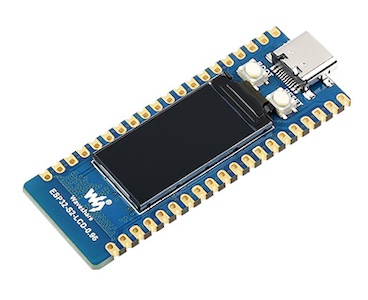

# LCD Display (ESP32-S2 0.96 inch)

## Table of Contents

- [Prolog](#prolog)
- [LCD basics (ST7735s)](#lcd-basics-st7735s)

## Prolog

If you buy the ESP32-S2 LCD from Waveshare with LCD (_two versions are available with display_), you can start quickly without soldering to use it. That's cool because there is On-board 0.96inch 160×80 pixels 65K color IPS LCD.

## LCD basics (ST7735s)

Unfortunately, the examples for this board do not explain anything that is really important for use with MicroPython. I myself had extreme problems getting the LCD to work until I finally found the right information on the net. This tutorial shows a few basics for using the display.

### Requirements

- ESP32-S2 MCU WiFi Development Board with LCD (_[Waveshare](https://www.waveshare.com/esp32-s2.htm)_)

**Example**



### Code

```shell
# create local script
$ touch ~/Projects/ESP/examples/display/esp32-s2-lcd_basics.py

# download driver module
$ curl -L 'https://raw.githubusercontent.com/Lupin3000/ESP/master/lib/st7735s_096_lcd.py' -o lib/st7735s_096_lcd.py
```

> [Source Code](../examples/display/esp32-s2-lcd_basics.py) for `esp32-s2-lcd_basics.py`
> 
> [Source Code](../lib/st7735s_096_lcd.py) for module `lib/st7735s_096_lcd.py`

```shell
# connect via rshell
(venv) $ rshell -p [SERIAL-PORT] 

# copy module file into /pyboard/lib/
/your/current/path> cp lib/st7735s_096_lcd.py /pyboard/lib/

# copy script as main.py
/your/current/path> cp examples/display/esp32-s2-lcd_basics.py /pyboard/main.py

# start repl
/your/current/path> repl
```

Start with keys `Control` + `d`. Stop the loop with keys `Control` + `c`. To leave the REPL, press keys `Control` + `x`.

> Feel free to develop the driver class for this LCD further!

[Home](https://github.com/Lupin3000/ESP) | [Previous](./011_display_sh1106_tutorials.md) | [Next](./012_network_tutorials.md)
