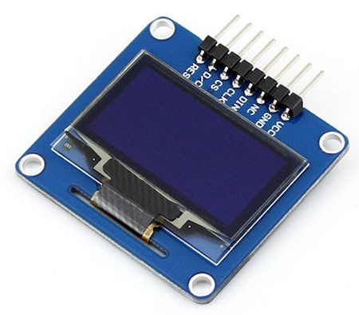

# OLED Display (sh1106)

## Table of Contents

- [Prolog](#prolog)
- [SPI OLED basics (SH1106)](#spi-oled-basics-sh1106)

## Prolog

There is a really nice monochrome display from [Waveshare](https://www.waveshare.com/1.3inch-oled-a.htm)! You can use 3 types of connection: SPI 4-wire, 3-wire and I2C. The advantage of SPI to I2C is the speed!

## SPI OLED basics (SH1106)

Mostly everything is similar to examples for SSD1306. Except the connection is this time via SPI and a different driver module is used. Okay ... the example is also a bit different.

### Requirements

- mandatory SPI OLED display (_SH1106 [Waveshare](https://www.waveshare.com/1.3inch-oled-a.htm)_)
- few cables
- optional breadboard

**Example**



### Connection/Wiring

On NodeMCU-ESP32 following connection is used:

| OLED SPI | ESP32          |
|----------|----------------|
| Pin VCC  | 3.3V (3V3)     |
| Pin GND  | GND            |
| Pin NC   | -              |
| Pin DIN  | GPIO 23 (Mosi) |
| Pin CLK  | GPIO 18 (SCK)  |
| Pin CS   | GPIO 05        |
| Pin DC   | GPIO 02        |
| Pin RES  | GPIO 04        |

> Check the pinout for your ESP32, it can be slightly different!

### Code

```shell
# create local script
$ touch ~/Projects/ESP/examples/display/spi_oled_sh1106_basics.py

# download driver module
$ curl -L 'https://raw.githubusercontent.com/robert-hh/SH1106/master/sh1106.py' -o lib/sh1106.py

# download images
$ curl -L 'https://raw.githubusercontent.com/Lupin3000/ESP/master/images/src/pill.pbm' -o images/src/pill.pbm
$ curl -L 'https://raw.githubusercontent.com/Lupin3000/ESP/master/images/src/morpheus.pbm' -o images/src/morpheus.pbm
$ curl -L 'https://raw.githubusercontent.com/Lupin3000/ESP/master/images/src/armchair.pbm' -o images/src/armchair.pbm
```

> [Source Code](../examples/display/spi_oled_sh1106_basics.py) for `spi_oled_sh1106_basics.py`
> 
> [Source Code](../lib/sh1106.py) for module `lib/sh1106.py`

Check your circuit (_adapt pins if needed via constants_) and copy the driver as `/pyboard/lib/sh1106.py`, the images into `/pyboard/lib/` and the script to the microcontroller as `/pyboard/main.py`.

```shell
# connect via rshell
(venv) $ rshell -p [SERIAL-PORT] 

# copy module file into /pyboard/lib/
/your/current/path> cp lib/sh1106.py /pyboard/lib/

# copy images into /pyboard/ directory
/your/current/path> cp images/src/pill.pbm /pyboard/
/your/current/path> cp images/src/morpheus.pbm /pyboard/
/your/current/path> cp images/src/armchair.pbm /pyboard/

# copy script as main.py
/your/current/path> cp examples/display/spi_oled_sh1106_basics.py /pyboard/main.py

# start repl
/your/current/path> repl
```

Start with keys `Control` + `d`. Stop the loop with keys `Control` + `c`. To leave the REPL, press keys `Control` + `x`.

[Home](https://github.com/Lupin3000/ESP) | [Previous](./011_display_nokia5110_pcd8544_tutorials.md) | [Next](./011_display_lcd_096_esp32-s2.md)
