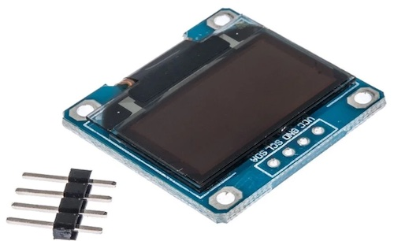

# OLED Display (ssd1306)

## Table of Contents

- [Prolog](#prolog)
- [I2C OLED (ssd1306)](#i2c-oled-basics-ssd1306)
- [I2C OLED date and time (ssd1306)](#i2c-oled-datetime-with-fonts-ssd1306)
- [Icons on OLED (ssd1306)](#icons-on-oled-ssd1306)

## Prolog

Today, almost nothing works for end users without displays. Displays are available in almost all sizes, shapes and colors and some still offer options (_e.g. touch_) that were unthinkable years ago. There are also different types such as LCD, OLED, TFT and so on.

You can use many of them on your ESP via MicroPython. Here are a few examples.

## I2C OLED basics (ssd1306)

The first example should show you a few basics. Play around with it (_modify the code_) and find out for yourself what else works.

### Requirements

- mandatory 1x I2C OLED (_example 0.96" 128x64_) 
- few cables 
- optional a breadboard

**Example**



### Circuit


### Code

Install first the `ssd1306` driver! [Here](./010_package_management.md) you will find some solutions proposals about how to install.

> If you're using the SPI version, just adapt the code! [Here](https://docs.micropython.org/en/latest/esp8266/tutorial/ssd1306.html) it's described.

```shell
# create new subdirectory
$ mkdir -p ~/Projects/ESP/examples/display

# create script
$ touch ~/Projects/ESP/examples/display/i2c_oled_ssd1306_basics.py
```

> [Source Code](../examples/display/i2c_oled_ssd1306_basics.py) for `i2c_oled_ssd1306_basics.py`

Check your circuit (_adapt pins if needed_) and copy the script to the microcontroller as `main.py`.

```shell
# copy file into pyboard as main.py
(venv) $ rshell -p [SERIAL-PORT] cp examples/display/i2c_oled_ssd1306_basics.py /pyboard/main.py

# start repl
(venv) $ rshell -p [SERIAL-PORT] repl
```

Start with keys `Control` + `d`. To leave the REPL, press keys `Control` + `x`.

## I2C OLED date/time with fonts (ssd1306)

Actually, this task seems very simple. But that is a bit deceptive! The font size and the current time will play a role in this example.

### Requirements

... same as [previous example](#requirements) ...

### Circuit

... same as [previous example](#circuit) ...

### Code

```shell
# create script
$ touch ~/Projects/ESP/examples/display/i2c_oled_ssd1306_time.py
```

> [Source Code](../examples/display/i2c_oled_ssd1306_time.py) for `i2c_oled_ssd1306_time.py`

You need 2 more modules. Download this to your local environment (_in the `lib` folder_).

```shell
# download font freesans
$ curl -L 'https://raw.githubusercontent.com/peterhinch/micropython-font-to-py/master/writer/freesans20.py' -o lib/freesans20.py

# download writer.py
$ curl -L 'https://raw.githubusercontent.com/miguelgrinberg/micropython-iot-tutorial/master/chapter6/writer.py' -o lib/writer.py
```

Check your circuit and copy the script to the microcontroller as `main.py`.

```shell
# start rshell serial connection
(venv) $ rshell -p [SERIAL-PORT]

# copy files from local project to microcontroller
/your/current/path> cp lib/freesans20.py /pyboard/lib/
/your/current/path> cp lib/writer.py /pyboard/lib/
/your/current/path> cp examples/display/i2c_oled_ssd1306_time.py /pyboard/main.py

# start the REPL
/your/current/path> repl
```
Start with keys `Control` + `d`. Stop the loop with keys `Control` + `c`. To leave the REPL, press keys `Control` + `x`.

> Since the time is set by `rshell` when connecting, the display is not up-to-date without `rshell`! An NTP time synchronization would be necessary for this. You can reproduce, for example, by pressing `reset` button of the device.

## Icons on OLED (ssd1306)

The objective of this example is to show how you can create icons. There will be two absolute identical icons (_25x25 px_) displayed, but created in two different ways.

### Requirements

... same as [first example](#requirements) ...

### Circuit

... same as [first example](#circuit) ...

### Code

```shell
# create script
$ touch ~/Projects/ESP/examples/display/i2c_oled_ssd1306_icons.py

# download image to local directory
$ curl -L 'https://raw.githubusercontent.com/Lupin3000/ESP/master/examples/display/demo.pbm' -o examples/display/demo.pbm
```

> [Source Code](../examples/display/i2c_oled_ssd1306_icons.py) for `i2c_oled_ssd1306_icons.py`

Check your circuit and copy the script to the microcontroller as `main.py`.

```shell
# start rshell serial connection
(venv) $ rshell -p [SERIAL-PORT]

# copy script to target
/your/current/path> cp examples/display/i2c_oled_ssd1306_icons.py /pyboard/main.py

# copy image to target
/your/current/path> cp examples/display/demo.pbm /pyboard/

# start the REPL
/your/current/path> repl
```

Start with keys `Control` + `d`. Stop the loop with keys `Control` + `c`. To leave the REPL, press keys `Control` + `x`.

> The simplest solution to create `*.pbm` is, to convert a standard format (_like JPG or PNG_) with [GIMP](https://www.gimp.org) (_GNU Image
Manipulation Program_).
> 
> Import an image: `File` -> `Open`  
> 
> Select on menubar: `Image` -> `Mode` -> `Indexed`
> 
> Select radio button: `Use black and white (1-bit) palette`
> 
> Enable checkbox: `Remove unused colors from colormap`
>
> Press button: `Convert`
> 
> Export with filename: `[YOUR NAME].pbm`
> 
> Select radio button: `Raw` and press button `Export`

[Home](https://github.com/Lupin3000/ESP) | [Previous](./010_i2c_helper_tutorials.md) | [Next](./011_display_nokia5110_pcd8544_tutorials.md)
