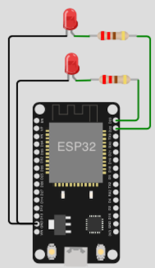

# Network Extended

## Table of Contents

- [Prolog](#prolog)
- [Toggle LEDs via Website](#toggle-leds-via-website)
- [Control NeoPixel from AdafruitIO](#control-neopixel-from-adafruitio)

## Prolog

Now that you've learned a few basics about network functions, here are a few application examples.

## Toggle LEDs via Website

In this example, a website is displayed in the browser using station mode. There are two toggle options on this web page to turn LEDs on or off.

> The example is kept very simple (_without further checks_). Once you have understood it, you can expand it at any time.

### Requirements

- mandatory 2x LEDs (_any color_)
- mandatory 2x resistors (_min. 220 ohms_)
- mandatory internet connection
- few cables
- optional a breadboard

### Circuit



### Code

```shell
# create script
$ touch ~/Projects/ESP/examples/network/led_controller_webserver.py

# create html
$ touch ~/Projects/ESP/examples/network/index.html
```

> [Source Code](../examples/network/led_controller_webserver.py) for `led_controller_webserver.py`
> 
> [Source Code](../examples/network/index.html) for html `index.html`
> 
> [Source Code](../examples/network/boot.py) for `boot.py`

Adjust the constants (_`boot.py` and `led_controller_webserver.py`_) according to your needs and check the circuit. Connect the microcontroller and transfer the files.

```shell
# copy script as main.py
(venv) $ rshell -p [SERIAL-PORT] cp examples/network/led_controller_webserver.py /pyboard/main.py

# copy html
(venv) $ rshell -p [SERIAL-PORT] cp examples/network/index.html /pyboard/

# copy boot.py
(venv) $ rshell -p [SERIAL-PORT] cp examples/network/boot.py /pyboard/

# start repl on microcontroller
(venv) $ rshell -p [SERIAL-PORT] repl
```

To start press `reset` key or start with keys `Control` + `d`. To interrupt press keys `Control` + `c`. To finish the `rshell` - `repl` session, press keys `Control` + `x`.

> If you don't know the IP, use for example `$ arp -a` (_inside local terminal_) and then enter 'http://[IP OF MICROCONTROLLER]' in the browser.

## Control NeoPixel from AdafruitIO

With an Adafruit account, you can also use Adafruit IO (_for free_)! This gives you the opportunity, for example, to create IoT dashboards and actions that display your measured values or to control devices. Here is an example to control the color of your NeoPixel (_from computer or mobile_).

### Requirements

- mandatory Adafruit IO Account (_free Adafruit IO Basic plan_)
- mandatory 1x NeoPixel (_Strip or Ring or Matrix_)
- few cables
- optional a breadboard

### Adafruit IO

If you don't have an Adafruit account yet, sign up and log in to [adafruit.io](https://io.adafruit.com).

> The free `Adafruit IO Basic Plan` is enough for this tutorial. There is no need to add any `Device`, `Action` or `Power-Up` to create `Feeds` and `Dashboards`!

**Steps**

1. create a new feed (_incl. name_) and note down feed key
2. create a new dashboard (_incl. name_)
3. via `Dashboard Settings` > `Edit Layout` > `Create New Block` add `Color Picker`
4. choose the feed for `Color Picker` and press `Next step`
5. select a `Test value` and press `Create block`
6. save all your settings `Dashboard Settings` > `Edit Layout` > `Save Layout`
7. note down `IO_USERNAME` and `IO_KEY`

### Pinout Table

| NeoPixel | ESP32 |
|----------|-------|
| GND      | GND   |
| DIN      | 23    |
| 5V       | 5V5   |

### Code

```shell
# create script
$ touch ~/Projects/ESP/examples/network/adafruit_io_neopixel.py
```

> [Source Code](../examples/network/adafruit_io_neopixel.py) for `adafruit_io_neopixel.py`
> 
> [Source Code](../examples/network/boot.py) for `boot.py`

Adjust the constants (_`boot.py` and `adafruit_io_neopixel.py`_) according to your needs and check the circuit. Connect the microcontroller and transfer the files.

```shell
# copy script as main.py
(venv) $ rshell -p [SERIAL-PORT] cp examples/network/adafruit_io_neopixel.py /pyboard/main.py

# copy boot.py
(venv) $ rshell -p [SERIAL-PORT] cp examples/network/boot.py /pyboard/

# start repl on microcontroller
(venv) $ rshell -p [SERIAL-PORT] repl
```

To start press `reset` key or start with keys `Control` + `d`. To interrupt press keys `Control` + `c`. To finish the `rshell` - `repl` session, press keys `Control` + `x`.

[Home](https://github.com/Lupin3000/ESP) | [Previous](./012_network_tutorials.md) | [Next](./013_human_interaction_tutorials.md)
