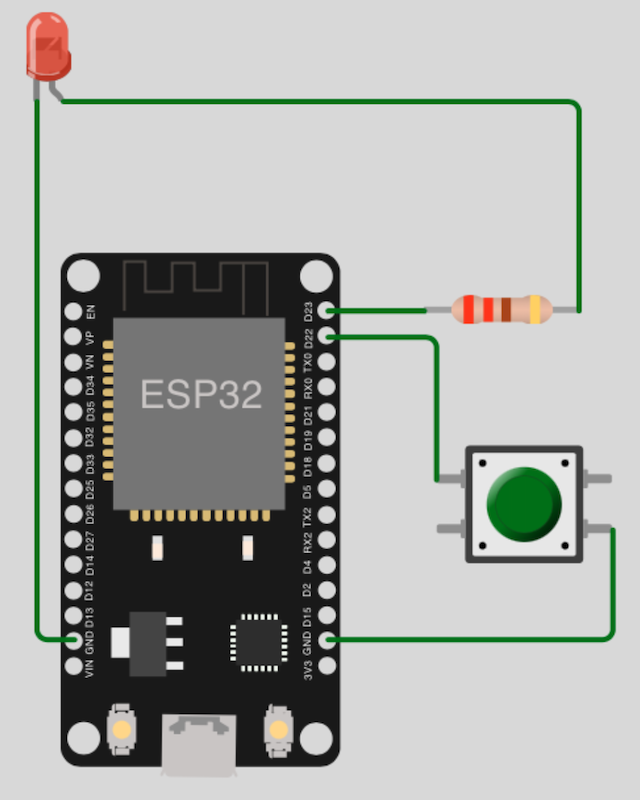
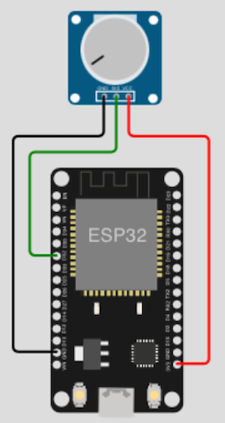
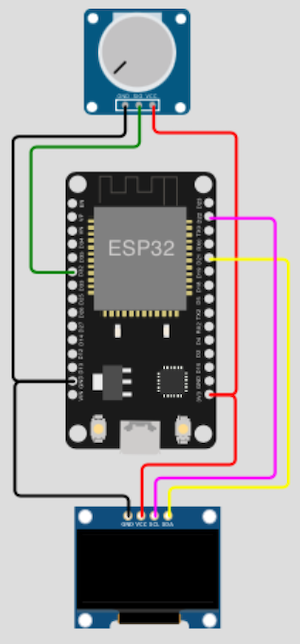
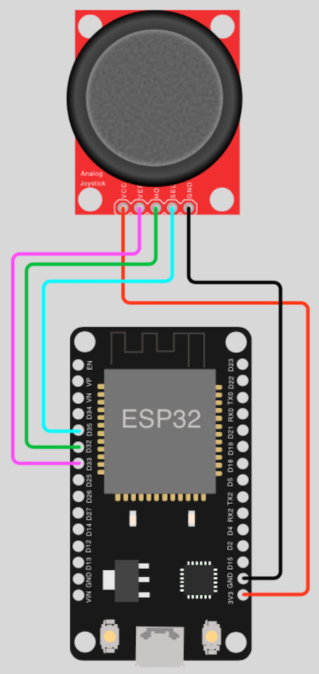

# Human interaction

## Table of Contents

- [Prolog](#prolog)
- [Button (Polling)](#button-polling)
- [Button (Interrupt Handler)](#button-interrupt-handler)
- [Button (Interrupt Handler and Debounce)](#button-interrupt-handler-and-debounce)
- [Potentiometer](#potentiometer)
- [Potentiometer and SSD1306 OLED](#potentiometer-and-ssd1306-oled)
- [Joystick (XY + Button)](#joystick-xy--button)

## Prolog

Till now, mostly all examples were without any direct human interaction (_all was done just by code_). This will change now! The following programs will respond to input.

## Button (Polling)

The objective is to turn an LED ON (_if LED is OFF_) or OFF (_if LED is ON_) with a button. In addition, the number of times the button was pressed should be counted and displayed. 

> As soon as you start the program, you will understand that it will not work. Even if you change the value of constant `DELAY_MILLISECONDS`.

### Requirements

- mandatory 1x RGB
- mandatory 1x button
- mandatory 1x resistor (_min. 220 ohms_)
- few cables
- optional breadboard

### Circuit



### Code

```shell
# create new subdirectory
$ mkdir -p ~/Projects/ESP/examples/user_input

# create script
$ touch ~/Projects/ESP/examples/user_input/btn_led_polling.py
```

> [Source Code](../examples/user_input/btn_led_polling.py) for `btn_led_polling.py`

Check your circuit and copy the script to the microcontroller as `main.py`.

```shell
# copy file into pyboard as main.py
(venv) $ rshell -p [SERIAL-PORT] cp examples/user_input/btn_led_polling.py /pyboard/main.py

# start repl
(venv) $ rshell -p [SERIAL-PORT] repl
```

Start with keys `Control` + `d`. Stop the loop with keys `Control` + `c`. To leave the REPL, press keys `Control` + `x`.

> There is also another disadvantage in case of `polling`, it does take a lot of the CPU resources!

## Button (Interrupt Handler)

The objective is exactly the same as in previous example. Just the code is changed to use `isr` (_interrupt service routines_).

### Requirements

... same as [previous example](#requirements) ...

### Circuit

... same as [previous example](#circuit) ...

### Code

```shell
# create script
$ touch ~/Projects/ESP/examples/user_input/btn_led_interrupt_handler.py
```

> [Source Code](../examples/user_input/btn_led_interrupt_handler.py) for `btn_led_interrupt_handler.py`

Check your circuit and copy the script to the microcontroller as `main.py`.

```shell
# copy file into pyboard as main.py
(venv) $ rshell -p [SERIAL-PORT] cp examples/user_input/btn_led_interrupt_handler.py /pyboard/main.py

# start repl
(venv) $ rshell -p [SERIAL-PORT] repl
```

Start with keys `Control` + `d`. To leave the REPL, press keys `Control` + `x`.

> If you observe the output, you see that the counter shows the problem with the button. Don't worry that will be solved in next example.

## Button (Interrupt Handler and Debounce)

Again, same objective but with measurement of milliseconds since button was last pressed. If the time difference is under 200 milliseconds, nothing will happen. 

### Requirements

... same as [previous example](#requirements) ...

### Circuit

... same as [previous example](#circuit) ...

### Code

```shell
# create script
$ touch ~/Projects/ESP/examples/user_input/btn_led_interrupt_handler_debounce.py
```

> [Source Code](../examples/user_input/btn_led_interrupt_handler_debounce.py) for `btn_led_interrupt_handler_debounce.py`

Check your circuit and copy the script to the microcontroller as `main.py`.

```shell
# copy file into pyboard as main.py
(venv) $ rshell -p [SERIAL-PORT] cp examples/user_input/btn_led_interrupt_handler_debounce.py /pyboard/main.py

# start repl
(venv) $ rshell -p [SERIAL-PORT] repl
```

Start with keys `Control` + `d`. To leave the REPL, press keys `Control` + `x`.

> Another solution for debouncing could be, to deactivate the IRQ for few milliseconds (_inside function interrupt_handler(pin)_). This would save you from the time measurement and calculation but (_like any sleep_) blocks the program flow.
> ```python
> ...
> btn.irq(handler=None)
> sleep_ms(200)
> btn.irq(trigger=Pin.IRQ_FALLING, handler=interrupt_handler)
> ...
>```
> Decide for yourself which is the best solution on your current particular problem!

## Potentiometer

With this passive component you can regulate the resistance (_in ohms_). On the ESP microcontroller, the ADC (_analog-digital converter_) then helps to display the value with a little MicroPython.

### Requirements

- mandatory 1x potentiometer (_e.g. 10 kilo ohms_)
- few cables
- optional breadboard

### Circuit



### Code

```shell
# create script
$ touch ~/Projects/ESP/examples/user_input/potentiometer.py
```

> [Source Code](../examples/user_input/potentiometer.py) for `potentiometer.py`

Check your circuit and copy the script to the microcontroller as `main.py`.

```shell
# copy file into pyboard as main.py
(venv) $ rshell -p [SERIAL-PORT] cp examples/user_input/potentiometer.py /pyboard/main.py

# start repl
(venv) $ rshell -p [SERIAL-PORT] repl
```

Start with keys `Control` + `d`. Stop the loop with keys `Control` + `c`. To leave the REPL, press keys `Control` + `x`.

## Potentiometer and SSD1306 OLED

Now the values should not be shown in the REPL but on the OLED display (_ssd1306_) - as graphics and text.

> If you miss the basic information about the OLED (_ssd1306_), have a look [here](./011_display_ssd1306_tutorials.md).

### Requirements

- mandatory 1x potentiometer (_e.g. 10 kilo ohms_)
- mandatory 1x I2C OLED (_example 0.96" 128x64_)
- few cables
- optional breadboard

### Circuit



### Code

```shell
# create script
$ touch ~/Projects/ESP/examples/user_input/potentiometer_display.py
```

> [Source Code](../examples/user_input/potentiometer_display.py) for `potentiometer_display.py`

Check your circuit and copy the script to the microcontroller as `main.py`.

```shell
# copy file into pyboard as main.py
(venv) $ rshell -p [SERIAL-PORT] cp examples/user_input/potentiometer_display.py /pyboard/main.py
```

Press `reset` button and and turn the potentiometer. If you don't have a `reset` button, just unplug and reconnect the USB cable.

## Joystick (XY + Button)

What would games be without joysticks? This type of user input is very old (_I had my first joysticks on the AMIGA500_). Actually, most joysticks are two potentiometers for the XY-axes. So here is a very simple example.

> **Note:** If you have a joystick without a button function, you can modify the relevant code.
> 
> **Important:** Even if the joystick can actually be operated with 5V, use 3.3V!

### Requirements

- mandatory 1x joystick
- few cables
- optional breadboard

### Circuit



### Code

```shell
# create script
$ touch ~/Projects/ESP/examples/user_input/joystick.py
```

> [Source Code](../examples/user_input/joystick.py) for `joystick.py`

Check your circuit and copy the script to the microcontroller as `main.py`.

```shell
# copy file into pyboard as main.py
(venv) $ rshell -p [SERIAL-PORT] cp examples/user_input/joystick.py /pyboard/main.py

# start repl
(venv) $ rshell -p [SERIAL-PORT] repl
```

Start with keys `Control` + `d`. Stop the loop with keys `Control` + `c`. To leave the REPL, press keys `Control` + `x`.

[Home](https://github.com/Lupin3000/ESP) | [Previous](./012_network_tutorials.md) | [Next](./013_human_interaction_extended.md)
