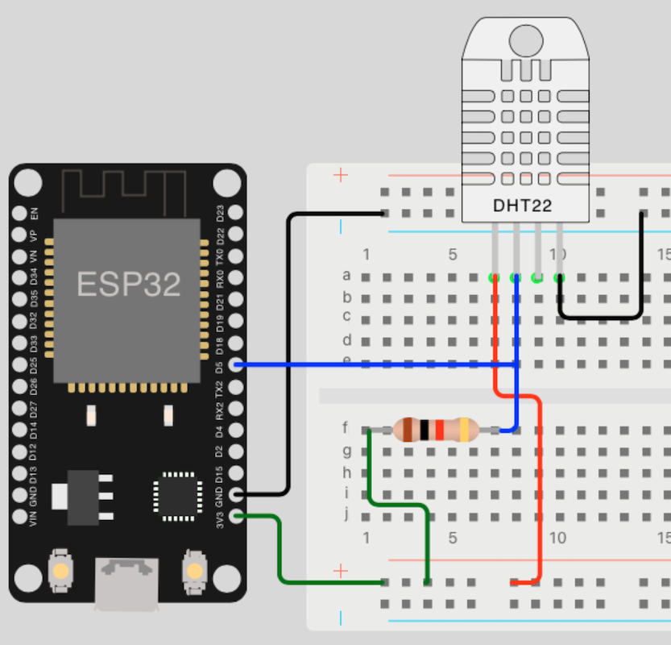
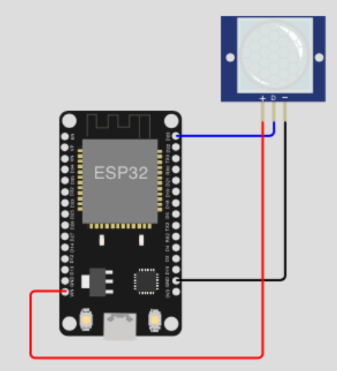
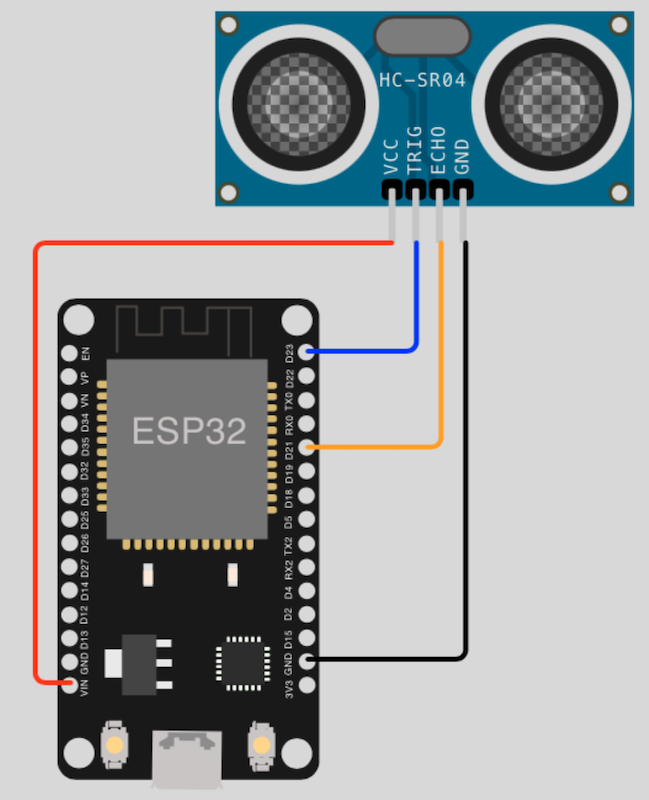
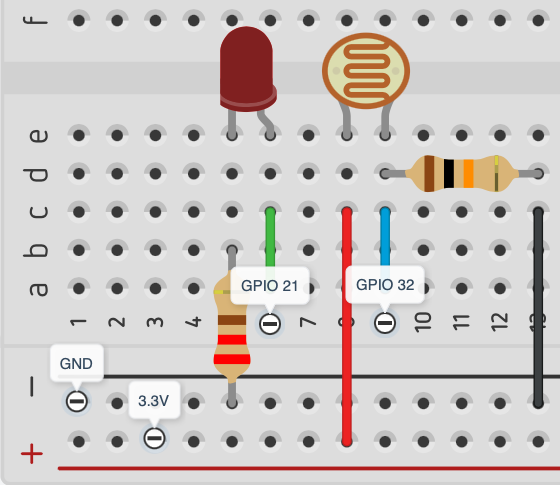

# Sensors

## Table of Contents

- [Prolog](#prolog)
- [Temperature/Humidity sensor (DHT11/DHT22)](#temperaturehumidity-sensor-dht11dht22)
- [PIR sensor (HC-SR501)](#pir-sensor-hc-sr501)
- [Ultrasonic sensor (HC-SR04)](#ultrasonic-sensor-hc-sr04)
- [Light/Shadow detection with LDR (Photo resistor)](#lightshadow-detection-with-ldr-photo-resistor)
- [IR Flame detection](#ir-flame-detection)

## Prolog

After the many previous examples, it is time to measure and collect data from the environment. Sensors are required for this. Depending on what is to be measured, special sensors are used. But there are also sensors that record several environmental variables!

## Temperature/Humidity sensor (DHT11/DHT22)

With the `DHT11/DHT22` you can record the temperature and humidity. The respective modules for both are already integrated in the standard firmware of MicroPython.


| Device | Delay  | Temperature  | Humidity   |
|--------|--------|--------------|------------|
| DHT11  | 1 sec. | 0 to 50 °C   | 20 to 90%  |
| DHT22  | 2 sec. | -40 to 80 °C | 0 to 100%  |

### Requirements

- mandatory 1x DHT11/DHT22 Sensor
- mandatory 1x Resistor (_min. 10 kilo ohms_)
- few cables
- optional breadboard

### Circuit



### Code

> You can use the same source code and circuit diagram for `DHT11` and `DHT22`! Only the import  and object must adapt for specific device.

```shell
# create new subdirectory
$ mkdir -p ~/Projects/ESP/examples/sensors

# create script
$ touch ~/Projects/ESP/examples/sensors/dht11.py
```

> [Source Code](../examples/sensors/dht11.py) for `dht11.py`

Check your circuit and copy the script to the microcontroller as `main.py`.

```shell
# copy file into pyboard as main.py
(venv) $ rshell -p [SERIAL-PORT] cp examples/sensors/dht11.py /pyboard/main.py

# start repl
(venv) $ rshell -p [SERIAL-PORT] repl
```

Start with keys `Control` + `d`. Stop the loop with keys `Control` + `c`. To leave the REPL, press keys `Control` + `x`.

## PIR sensor (HC-SR501)

If you want to detect movements in the area, the PIR sensor is already suitable. The sensors are available in various variants. 

### Requirements

- mandatory PIR Sensor (_HC-SR501_)
- few cables
- optional breadboard

### Circuit



### Code

```shell
# create script
$ touch ~/Projects/ESP/examples/sensors/pir.py
```

> [Source Code](../examples/sensors/pir.py) for `pir.py`

Check your circuit and copy the script to the microcontroller as `main.py`.

```shell
# copy file into pyboard as main.py
(venv) $ rshell -p [SERIAL-PORT] cp examples/sensors/pir.py /pyboard/main.py

# start repl
(venv) $ rshell -p [SERIAL-PORT] repl
```

Start with keys `Control` + `d`. Stop the loop with keys `Control` + `c`. To leave the REPL, press keys `Control` + `x`.


## Ultrasonic sensor (HC-SR04)

There are various ways of measuring the distance to objects. Depending on the area of application and the environment, they have strengths and weaknesses. Here is a sensor that uses ultrasound.

### Requirements

- mandatory Ultrasonic Sensor (_HC-SR04_)
- few cables
- optional breadboard

### Circuit



### Code

```shell
# create script
$ touch ~/Projects/ESP/examples/sensors/hcsr04.py
```

> [Source Code](../examples/sensors/hcsr04.py) for `hcsr04.py`

Check your circuit and copy the script to the microcontroller as `main.py`.

```shell
# copy file into pyboard as main.py
(venv) $ rshell -p [SERIAL-PORT] cp examples/sensors/hcsr04.py /pyboard/main.py

# start repl
(venv) $ rshell -p [SERIAL-PORT] repl
```

Start with keys `Control` + `d`. Stop the loop with keys `Control` + `c`. To leave the REPL, press keys `Control` + `x`.

## Light/Shadow detection with LDR (Photo resistor)

With an LDR sensor you can capture/measure the light in the environment. LDR is also referred to as a photoresistor, photocell, or photoconductor. In the current example, the ADC is used on the microcontroller. There are also digital LDRs. 

### Requirements

- mandatory 1x LED (_any color_)
- mandatory 1x Resistor (_min. 220 ohms_)
- mandatory 1x LDR Photo resistor
- mandatory 1x Resistor (_min. 10 kilo ohms_) 
- few cables
- optional breadboard

### Circuit



> Unfortunately [Wokwi](https://wokwi.com) has another LDR module, [Tinkercad](https://www.tinkercad.com) doesn't have the ESP32 NodeMCU and I don't have [Fritzing](https://fritzing.org) installed. Therefore, this time only the GPIO hints.

### Code

```shell
# create script
$ touch ~/Projects/ESP/examples/sensors/shadow_detection.py
```

> [Source Code](../examples/sensors/shadow_detection.py) for `shadow_detection.py`

Check your circuit and copy the script to the microcontroller as `main.py`.

```shell
# copy file into pyboard as main.py
(venv) $ rshell -p [SERIAL-PORT] cp examples/sensors/shadow_detection.py /pyboard/main.py

# start repl
(venv) $ rshell -p [SERIAL-PORT] repl
```

Start with keys `Control` + `d`. Stop the loop with keys `Control` + `c`. To leave the REPL, press keys `Control` + `x`.

> You can use the protective cap of pens to darken the sensor.

## IR Flame detection

Fire... fire... help it burns! With this sensor you can prevent worse.

### Requirements

- mandatory 1x LED (_any color_)
- mandatory 1x Resistor (_min. 220 ohms_)
- mandatory 1x IR Flame Sensor (_[3 Pins - Digital](https://www.pcboard.ca/flame-sensor-module)_)
- few cables
- optional breadboard

### Pinout table

| IR device | ESP32 |
|-----------|-------|
| VCC       | 3V3   |
| GND       | GND   |
| DO        | 21    |

### Code

```shell
# create script
$ touch ~/Projects/ESP/examples/sensors/shadow_detection.py
```

> [Source Code](../examples/sensors/ir_flame_detection.py) for `ir_flame_detection.py`

Check your circuit and copy the script to the microcontroller as `main.py`.

```shell
# copy file into pyboard as main.py
(venv) $ rshell -p [SERIAL-PORT] cp examples/sensors/ir_flame_detection.py /pyboard/main.py

# start repl
(venv) $ rshell -p [SERIAL-PORT] repl
```

Start with keys `Control` + `d`. Stop the loop with keys `Control` + `c`. To leave the REPL, press keys `Control` + `x`.

> You can test the sensor very well with a lighter. But don't burn down your house!

[Home](https://github.com/Lupin3000/ESP) | [Previous](./013_human_interaction_extended.md) | [Next](./014_sensor_extended.md)
