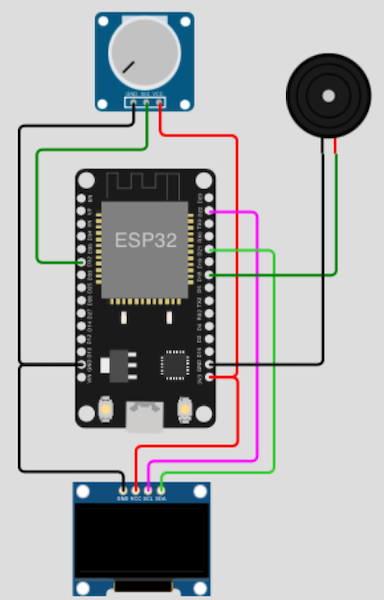

# Games

## Table of Contents

- [Prolog](#prolog)
- [Crazy Car Racer](#crazy-car-racer)
- [Space Invaders](#space-invaders)
- [Pong](#pong)
- [Snake](#snake)
- [Mini Slot](#mini-slot)
- [Human attack Aliens](#human-attack-aliens)
- [StarFighters](#starfighters)
- [Tic-Tac-Toe](#tic-tac-toe)

## Prolog

Games are great and help to forget everyday life. In addition, the development of games helps to discover new possibilities and to expand the own knowledge.

## Crazy Car Racer

It's a cold and dark night. The drugs are still working and your blood is boiling. You get in your car and take off. As in reality, there is only one life and if you collide ... game over.

### Requirements

- mandatory 1x I2C OLED (_example 0.96" 128x64_) 
- mandatory 1x potentiometer (_e.g. 10 kilo ohms_)
- mandatory 1x passive buzzer (_Piezo Buzzer_)
- few cables 
- optional a breadboard

### Circuit



### Code

```shell
# create new subdirectory
$ mkdir -p ~/Projects/ESP/examples/games

# create local script
$ touch ~/Projects/ESP/examples/games/racer.py

# download images
$ curl -L 'https://raw.githubusercontent.com/Lupin3000/ESP/master/images/src/racer_car.pbm' -o images/src/racer_car.pbm
$ curl -L 'https://raw.githubusercontent.com/Lupin3000/ESP/master/images/src/racer_dead.pbm' -o images/src/racer_dead.pbm
$ curl -L 'https://raw.githubusercontent.com/Lupin3000/ESP/master/images/src/racer_intro.pbm' -o images/src/racer_intro.pbm
```

> [Source Code](../examples/games/racer.py) for `racer.py`
> 
> [Source Code](../lib/ssd1306.py) for `lib/ssd1306.py`

Check your circuit careful, connect the microcontroller and copy needed files to the microcontroller.

```shell
# copy images into /pyboard/ directory
(venv) $ rshell -p [SERIAL-PORT] cp images/src/racer_car.pbm /pyboard/
(venv) $ rshell -p [SERIAL-PORT] cp images/src/racer_dead.pbm /pyboard/
(venv) $ rshell -p [SERIAL-PORT] cp images/src/racer_intro.pbm /pyboard/

# copy script as main.py
(venv) $ rshell -p [SERIAL-PORT] cp examples/games/racer.py /pyboard/main.py

# copy module file into /pyboard/lib/
(venv) $ rshell -p [SERIAL-PORT] cp lib/ssd1306.py /pyboard/lib/

# start repl on microcontroller
(venv) $ rshell -p [SERIAL-PORT] repl
```

To start your game press `reset` key or start with keys `Control` + `d`. To interrupt press keys `Control` + `c`. To finish the `rshell` - `repl` session, press keys `Control` + `x`.

> Feel free to expand the game! For example, add more objects that simulate trees and bushes or more levels (_after about 10 points the road gets smaller_) and so on.

## Space Invaders

Everyone knows the Space Invaders! But nobody knows where they come from. If you value our planet, protect our world from these invaders.

### Requirements

- mandatory 1x SPI LCD Nokia 5110 
- mandatory 1x potentiometer (_e.g. 10 kilo ohms_)
- mandatory 1x button
- few cables 
- optional a breadboard

### Code

```shell
# create local script
$ touch ~/Projects/ESP/examples/games/invader.py
```

> [Source Code](../examples/games/invader.py) for `invader.py`
> 
> [Source Code](../lib/pcd8544.py) for `lib/pcd8544.py`

Check your circuit careful, connect the microcontroller and copy needed files to the microcontroller.

```shell
# copy script as main.py
(venv) $ rshell -p [SERIAL-PORT] cp examples/games/invader.py /pyboard/main.py

# copy module file into /pyboard/lib/
(venv) $ rshell -p [SERIAL-PORT] cp lib/pcd8544.py /pyboard/lib/

# start repl on microcontroller
(venv) $ rshell -p [SERIAL-PORT] repl
```

To start your game press `reset` key or start with keys `Control` + `d`. To interrupt press keys `Control` + `c`. To finish the `rshell` - `repl` session, press keys `Control` + `x`.

> Feel free to expand the game! For example, add more objects enemies or change speed if enemy goes down.

## Pong

On of the retro-gaming classics! Catch the ball or die... 

## Requirements

- mandatory 1x NeoPixel Matrix (_[LED Matrix Panel ](https://www.waveshare.com/pico-rgb-led.htm)_)
- mandatory 1x potentiometer (_e.g. 10 kilo ohms_)
- few cables 
- optional a breadboard

### Code

```shell
# create local script
$ touch ~/Projects/ESP/examples/games/pong.py
```

> [Source Code](../examples/games/pong.py) for `pong.py`
>
> [Source Code](../lib/neopixelmatrix.py) for `lib/neopixelmatrix.py`

Check your circuit careful, connect the microcontroller and copy needed files to the microcontroller.

```shell
# copy script as main.py
(venv) $ rshell -p [SERIAL-PORT] cp examples/games/pong.py /pyboard/main.py

# copy module file into /pyboard/lib/
(venv) $ rshell -p [SERIAL-PORT] cp lib/neopixelmatrix.py /pyboard/lib/

# start repl on microcontroller
(venv) $ rshell -p [SERIAL-PORT] repl
```

To start your game press `reset` key or start with keys `Control` + `d`. To interrupt press keys `Control` + `c`. To finish the `rshell` - `repl` session, press keys `Control` + `x`.

> Feel free to expand the game! For example, increase continuously the speed after some minutes.

## Snake

The vegan snake grows with every fruit it eats. But beware! Don't get to the edge or your own tail.

## Requirements

- mandatory 1x SPI OLED DISPLAY (_e.g. SH1106_) 
- mandatory 1x Joystick
- few cables 
- optional a breadboard

### Code

```shell
# create local script
$ touch ~/Projects/ESP/examples/games/snake.py
```

> [Source Code](../examples/games/snake.py) for `snake.py`
>
> [Source Code](../lib/sh1106.py) for `lib/sh1106.py`

Check your circuit careful, connect the microcontroller and copy needed files to the microcontroller.

```shell
# copy script as main.py
(venv) $ rshell -p [SERIAL-PORT] cp examples/games/snake.py /pyboard/main.py

# copy module file into /pyboard/lib/
(venv) $ rshell -p [SERIAL-PORT] cp lib/sh1106.py /pyboard/lib/

# start repl on microcontroller
(venv) $ rshell -p [SERIAL-PORT] repl
```

To start your game press `reset` key or start with keys `Control` + `d`. To interrupt press keys `Control` + `c`. To finish the `rshell` - `repl` session, press keys `Control` + `x`.

> Feel free to expand the game! For example, add speed or other enemies which eats the fruits too.

## Mini Slot

Gambling is very popular with many people. Unfortunately, the bank always wins... Be the bank and rip everyone off.

## Requirements

- mandatory 1x I2C OLED DISPLAY (_e.g. SSD1306_) 
- mandatory 1x Button
- few cables 
- optional a breadboard

### Code

```shell
# create local script
$ touch ~/Projects/ESP/examples/games/slot.py
```

> [Source Code](../examples/games/slot.py) for `slot.py`
>
> [Source Code](../lib/ssd1306.py) for `lib/ssd1306.py`

Check your circuit careful, connect the microcontroller and copy needed files to the microcontroller.

```shell
# copy script as main.py
(venv) $ rshell -p [SERIAL-PORT] cp examples/games/slot.py /pyboard/main.py

# copy module file into /pyboard/lib/
(venv) $ rshell -p [SERIAL-PORT] cp lib/ssd1306.py /pyboard/lib/

# start repl on microcontroller
(venv) $ rshell -p [SERIAL-PORT] repl
```

To start your game press `reset` key or start with keys `Control` + `d`. To interrupt press keys `Control` + `c`. To finish the `rshell` - `repl` session, press keys `Control` + `x`.

> Feel free to expand the game! For example, add a balance to bet for money.

## Human attack Aliens

This time you are an alien protector who has to defend himself against the human race. Protect your spaceship and destroy all humans attackers.

## Requirements

- mandatory 1x I2C OLED DISPLAY (_e.g. SSD1306_) 
- mandatory 1x analog joystick
- few cables 
- optional a breadboard

### Code

```shell
# create local script
$ touch ~/Projects/ESP/examples/games/alien.py

# create picture file
$ touch ~/Projects/ESP/examples/games/pictures.py
```

> [Source Code](../examples/games/alien.py) for `alien.py`
> 
> [Source Code](../examples/games/pictures.py) for `pictures.py` 
>
> [Source Code](../lib/ssd1306.py) for `lib/ssd1306.py`

Check your circuit careful, connect the microcontroller and copy needed files to the microcontroller.

```shell
# copy script as main.py
(venv) $ rshell -p [SERIAL-PORT] cp examples/games/alien.py /pyboard/main.py

# copy picture file into /pyboard/lib/
(venv) $ rshell -p [SERIAL-PORT] cp examples/games/pictures.py /pyboard/lib/

# copy module file into /pyboard/lib/
(venv) $ rshell -p [SERIAL-PORT] cp lib/ssd1306.py /pyboard/lib/

# start repl on microcontroller
(venv) $ rshell -p [SERIAL-PORT] repl
```

To start your game press `reset` key or start with keys `Control` + `d`. To interrupt press keys `Control` + `c`. To finish the `rshell` - `repl` session, press keys `Control` + `x`.

> Feel free to expand the game! For example, let humans walk or add air attacks to the spaceship.

## StarFighters

There's an epic battle raging out there in space. Be part of this fight and destroy your opponents.

## Requirements

- mandatory 1x I2C OLED DISPLAY (_e.g. SSD1306_) 
- mandatory 1x potentiometer
- few cables 
- optional a breadboard

### Code

```shell
# create local script
$ touch ~/Projects/ESP/examples/games/starfighter.py
```

> [Source Code](../examples/games/starfighter.py) for `starfighter.py` 
>
> [Source Code](../lib/ssd1306.py) for `lib/ssd1306.py`

Check your circuit careful, connect the microcontroller and copy needed files to the microcontroller.

```shell
# copy script as main.py
(venv) $ rshell -p [SERIAL-PORT] cp examples/games/starfighter.py /pyboard/main.py

# copy module file into /pyboard/lib/
(venv) $ rshell -p [SERIAL-PORT] cp lib/ssd1306.py /pyboard/lib/

# start repl on microcontroller
(venv) $ rshell -p [SERIAL-PORT] repl
```

To start your game press `reset` key or start with keys `Control` + `d`. To interrupt press keys `Control` + `c`. To finish the `rshell` - `repl` session, press keys `Control` + `x`.

> Feel free to expand the game! For example, add a button for shooting or let the enemy faster move.

## Tic-Tac-Toe

Also, a well-known already old multiplayer game. Oh yes, the time at school was nice.

## Requirements

- mandatory 1x SPI OLED DISPLAY (_e.g. SH1106_) 
- mandatory 1x analog joystick
- few cables 
- optional a breadboard

### Code

```shell
# create local script
$ touch ~/Projects/ESP/examples/games/tictactoe.py
```

> [Source Code](../examples/games/tictactoe.py) for `tictactoe.py` 
>
> [Source Code](../lib/sh1106.py) for `lib/sh1106.py`

Check your circuit careful, connect the microcontroller and copy needed files to the microcontroller.

```shell
# copy script as main.py
(venv) $ rshell -p [SERIAL-PORT] cp examples/games/tictactoe.py /pyboard/main.py

# copy module file into /pyboard/lib/
(venv) $ rshell -p [SERIAL-PORT] cp lib/sh1106.py /pyboard/lib/

# start repl on microcontroller
(venv) $ rshell -p [SERIAL-PORT] repl
```

To start your game press `reset` key or start with keys `Control` + `d`. To interrupt press keys `Control` + `c`. To finish the `rshell` - `repl` session, press keys `Control` + `x`.

> Feel free to expand the game! For example, add few more effects or nice introduction.

[Home](https://github.com/Lupin3000/ESP) | [Previous](./014_sensor_extended.md) | [Next](./016_build_firmware.md)
