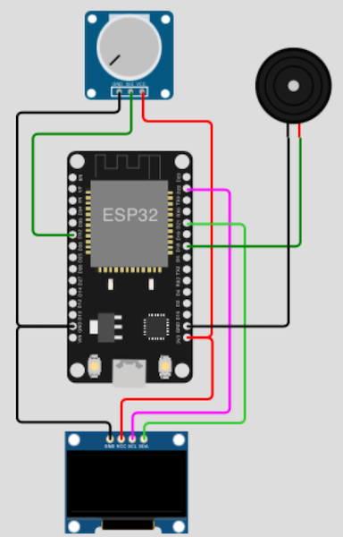

# Games

## Table of Contents

- [Prolog](#prolog)
- [Crazy Car Racer](#crazy-car-racer)

## Prolog

Games are great and help to forget everyday life. In addition, the development of games helps to discover new possibilities and to expand the own knowledge.

## Crazy Car Racer

When I created the examples with the OLED display and the potentiometers, this game came to my mind. The goal is to control a small car horizontally using a potentiometer and avoid obstacles. As in reality, there is only one life and if you collide ... game over.

### Requirements

- mandatory 1x I2C OLED (_example 0.96" 128x64_) 
- mandatory 1x potentiometer (_e.g. 10 kilo ohms_)
- mandatory 1x passive buzzer (_Piezo Buzzer_)
- few cables 
- optional a breadboard

### Circuit



### Code

```shell
# create new subdirectory
$ mkdir -p ~/Projects/ESP/examples/games

# create script
$ touch ~/Projects/ESP/examples/games/racer.py

# download images
$ curl -L 'https://raw.githubusercontent.com/Lupin3000/ESP/master/examples/games/racer_car.pbm' -o examples/games/racer_car.pbm
$ curl -L 'https://raw.githubusercontent.com/Lupin3000/ESP/master/examples/games/racer_dead.pbm' -o examples/games/racer_dead.pbm
$ curl -L 'https://raw.githubusercontent.com/Lupin3000/ESP/master/examples/games/racer_intro.pbm' -o examples/games/racer_intro.pbm
```

> [Source Code](../examples/games/racer.py) for `racer.py`

Check your circuit and copy all images and the script to the microcontroller.

```shell
# start serial connection
(venv) $ rshell -p [SERIAL-PORT]

# upload images
(venv) $ rshell -p [SERIAL-PORT] cp examples/games/racer_car.pbm /pyboard/
(venv) $ rshell -p [SERIAL-PORT] cp examples/games/racer_dead.pbm /pyboard/
(venv) $ rshell -p [SERIAL-PORT] cp examples/games/racer_intro.pbm /pyboard/

# upload script
(venv) $ rshell -p [SERIAL-PORT] cp examples/games/racer.py /pyboard/main.py
```

Press `reset` key or start with keys `Control` + `d`.

> Feel free to expand the game! For example, add more objects that simulate trees and bushes or more levels (_after about 10 points the road gets smaller_) and so on.

[Home](https://github.com/Lupin3000/ESP) | [Previous](./014_sensor_tutorials.md) | [Next]()
