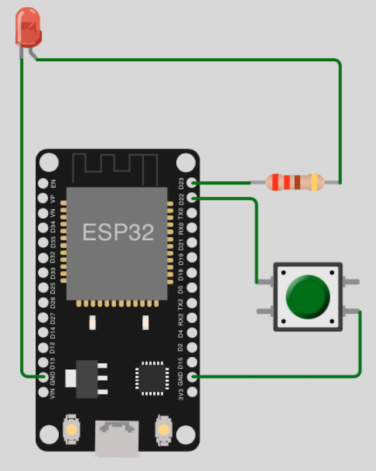

# Human interaction tutorials

# Network tutorials

## Table of Contents

- [Prolog](#prolog)
- [Button (Polling)](#button-polling)
- [Button (Interrupt Handler)](#button-interrupt-handler)

## Prolog

Till now, mostly all examples were without any direct human interaction (_all was done just by code_). This will change now! The following programs will respond to input.

## Button (Polling)

The objective is to turn an LED ON (_if LED is OFF_) or OFF (_if LED is ON_) with a button. In addition, the number of times the button was pressed should be counted and displayed. 

> As soon as you start the program, you will understand that it will not work. Even if you change the value of constant `DELAY_MILLISECONDS`.

### Requirements

- mandatory 1x RGB
- mandatory 1x button
- mandatory 1x resistor (_min. 220 ohms_)
- few cables
- optional breadboard

### Circuit



### Code

```shell
# create new subdirectory
$ mkdir -p ~/Projects/ESP/examples/user_input

# create script
$ touch ~/Projects/ESP/examples/user_input/btn_led_polling.py
```

> [Source Code](../examples/user_input/btn_led_polling.py) for `btn_led_polling.py`

Check your circuit and copy the script to the microcontroller as `main.py`.

```shell
# copy file into pyboard as main.py
(venv) $ rshell -p [SERIAL-PORT] cp examples/user_input/btn_led_polling.py /pyboard/main.py

# start repl
(venv) $ rshell -p [SERIAL-PORT] repl
```

Start with keys `Control` + `d`. Stop the loop with keys `Control` + `c`. To leave the REPL, press keys `Control` + `x`.

> There is also an other disadvantage in case of `polling`, it does take a lot of the CPU resources!

## Button (Interrupt Handler)

The objective is exactly the same as in previous example. Just the code is changed to use `isr` (_interrupt service routines_).

### Requirements

... same as [previous example](#requirements) ...

### Circuit

... same as [previous example](#circuit) ...

### Code

```shell
# create script
$ touch ~/Projects/ESP/examples/user_input/btn_led_interrupt_handler.py
```

> [Source Code](../examples/user_input/btn_led_interrupt_handler.py) for `btn_led_interrupt_handler.py`

Check your circuit and copy the script to the microcontroller as `main.py`.

```shell
# copy file into pyboard as main.py
(venv) $ rshell -p [SERIAL-PORT] cp examples/user_input/btn_led_interrupt_handler.py /pyboard/main.py

# start repl
(venv) $ rshell -p [SERIAL-PORT] repl
```

Start with keys `Control` + `d`. Stop the loop with keys `Control` + `c`. To leave the REPL, press keys `Control` + `x`.

> If you observe the output, you see that the counter shows the problem with the button. Don't worry that will be solved in next example.

[Home](https://github.com/Lupin3000/ESP) | [Previous](./016_network_tutorials.md) | [Next]()
